# Spring Boot Docker Application

โปรเจ็กต์ Spring Boot REST API ที่ทำงานใน Docker Container พร้อมด้วย CI/CD Pipeline ผ่าน Jenkins, GitHub Actions และการแจ้งเตือนผ่าน N8N


## 📋 Table of Contents

- [Spring Boot Docker Application](#spring-boot-docker-application)
  - [📋 Table of Contents](#-table-of-contents)
  - [🚀 Features](#-features)
  - [🏗️ Project Structure](#️-project-structure)
  - [🛠️ Prerequisites](#️-prerequisites)
  - [⚡ Quick Start](#-quick-start)
    - [1. Clone Repository](#1-clone-repository)
    - [2. Local Development](#2-local-development)
    - [3. Docker Development](#3-docker-development)
  - [🐳 Docker Commands](#-docker-commands)
  - [🧪 Testing](#-testing)
  - [🔄 CI/CD Pipeline](#-cicd-pipeline)
  - [⚡ GitHub Actions](#-github-actions)
  - [📡 API Endpoints](#-api-endpoints)
  - [🔧 Configuration](#-configuration)
  - [📝 Environment Variables](#-environment-variables)
  - [📊 Test Coverage](#-test-coverage)
  - [🤝 Contributing](#-contributing)
  - [📄 License](#-license)

## 🚀 Features

- ✅ **Spring Boot REST API** - RESTful API endpoints with comprehensive functionality
- 🐳 **Multi-stage Docker Build** - Optimized Docker image with build and runtime stages
- ☕ **Java 21** - Latest LTS Java version support
- 🧪 **Comprehensive Testing** - Unit tests, integration tests, and test coverage
- 🔄 **CI/CD Pipeline** - Automated Jenkins pipeline with Maven
- ⚡ **GitHub Actions** - Modern CI/CD with GitHub-native automation
- 📊 **JaCoCo Coverage** - Code coverage reports and analysis
- 📦 **Docker Hub Integration** - Automated image publishing
- 🔔 **N8N Notifications** - Webhook-based notifications
- 🏷️ **Semantic Versioning** - Build number based tagging
- 🩺 **Health Check** - Built-in health monitoring endpoint

## 🏗️ Project Structure

```
springboot-docker-app/
├── 📁 src/
│   ├── 📁 main/
│   │   ├── 📁 java/
│   │   │   └── 📁 com/example/demo/
│   │   │       ├── 📄 DemoApplication.java        # Main Spring Boot application
│   │   │       ├── 📁 controller/
│   │   │       │   └── 📄 HelloController.java    # REST API controller
│   │   │       └── 📁 model/
│   │   │           └── 📄 GreetingRequest.java    # Request/Response models
│   │   └── 📁 resources/
│   │       ├── 📄 application.properties          # Application configuration
│   │       ├── 📁 static/                         # Static web resources
│   │       └── 📁 templates/                      # Template files
│   └── 📁 test/
│       └── 📁 java/
│           └── 📁 com/example/demo/
│               ├── 📄 DemoApplicationTests.java           # Application context tests
│               ├── 📁 controller/
│               │   └── 📄 HelloControllerTest.java        # Unit tests
│               └── 📁 integration/
│                   └── 📄 HelloControllerIntegrationTest.java # Integration tests
├── 📁 target/                      # Maven build output
│   ├── 📁 classes/                 # Compiled classes
│   ├── 📁 site/jacoco/            # JaCoCo coverage reports
│   └── 📁 surefire-reports/       # Test reports
├── � .github/
│   └── 📁 workflows/
│       └── 📄 main.yml             # GitHub Actions workflow
├── �🐳 Dockerfile                  # Multi-stage Docker build
├── 🔧 Jenkinsfile                 # Jenkins CI/CD pipeline
├── 📄 pom.xml                     # Maven configuration
├── 📄 mvnw                        # Maven wrapper (Unix)
├── 📄 mvnw.cmd                    # Maven wrapper (Windows)
├── 📖 README.md                   # Project documentation
└── 📄 HELP.md                     # Spring Boot help
```

## 🛠️ Prerequisites

- **Java 21+** (JDK)
- **Maven 3.8+** (or use included wrapper)
- **Docker & Docker Compose**
- **Git**
- **Jenkins** (for CI/CD)
- **N8N** (for notifications, optional)

## ⚡ Quick Start

### 1. Clone Repository

```bash
git clone <repository-url>
cd springboot-docker-app
```

### 2. Local Development

```bash
# Using Maven wrapper (recommended)
./mvnw spring-boot:run

# Using installed Maven
mvn spring-boot:run

# Access the API
curl http://localhost:8080/api/hello
```

### 3. Docker Development

```bash
# Build Docker image
docker build -t springboot-docker-app .

# Run container
docker run -p 8080:8080 springboot-docker-app

# Access the API
curl http://localhost:8080/api/hello
```

## 🐳 Docker Commands

```bash
# Build multi-stage image with tag
docker build -t iamsamitdev/springboot-docker-app:latest .

# Run container in background
docker run -d -p 8080:8080 --name springboot-app springboot-docker-app

# View logs
docker logs springboot-app

# Follow logs
docker logs -f springboot-app

# Stop container
docker stop springboot-app

# Remove container
docker rm springboot-app

# Push to Docker Hub
docker push iamsamitdev/springboot-docker-app:latest
```

## 🧪 Testing

```bash
# Run all tests
./mvnw test

# Run tests with coverage
./mvnw clean test jacoco:report

# Run specific test class
./mvnw test -Dtest=HelloControllerTest

# Run specific test method
./mvnw test -Dtest=HelloControllerTest#testHelloEndpoint

# Skip tests during build
./mvnw package -DskipTests

# Run integration tests only
./mvnw test -Dtest=*IntegrationTest
```

### Test Structure

- **Unit Tests**: `HelloControllerTest.java` - Controller layer testing
- **Integration Tests**: `HelloControllerIntegrationTest.java` - Full API testing
- **Application Tests**: `DemoApplicationTests.java` - Context loading tests

## 🔄 CI/CD Pipeline

Jenkins Pipeline stages:

1. **🔍 Checkout** - Pull latest code from repository
2. **🧪 Run Tests** - Execute unit and integration tests with coverage
3. **📦 Build Application** - Create JAR file with Maven
4. **🐳 Build Docker Image** - Multi-stage Docker build
5. **📤 Push to Docker Hub** - Upload to container registry
6. **🔔 Notify** - Send N8N webhook notification

### Pipeline Features

- ✅ Maven-based build system
- 🧪 Automated testing with JUnit 5
- 📊 JaCoCo code coverage reporting
- 🐳 Multi-stage Docker builds for optimization
- 📈 Test result publishing
- 🔔 Slack/Discord notifications via N8N

### 📊 Jenkins Pipeline Diagram

```mermaid
graph TD
    A[🔍 Start Pipeline] --> B[📥 Checkout Code]
    B --> C[🔧 Set up Maven Environment]
    C --> D[📦 Maven Dependencies]
    D --> E[🧪 Run Tests & Coverage]
    E --> F{Tests Pass?}
    F -->|✅ Yes| G[📊 Publish Test Results]
    F -->|❌ No| M[📧 Notify Failure]
    G --> H[🏗️ Maven Build JAR]
    H --> I[🐳 Build Docker Image]
    I --> J[🔑 Docker Hub Login]
    J --> K[📤 Push to Registry]
    K --> L[🔔 N8N Success Notification]
    M --> N[❌ Pipeline Failed]
    L --> O[✅ Pipeline Complete]
    
    style A fill:#e1f5fe
    style O fill:#c8e6c9
    style N fill:#ffcdd2
    style F fill:#fff3e0
```



### Pipeline Stages Detail

| Stage | Description | Tools | Duration |
|-------|-------------|-------|----------|
| **Checkout** | Pull latest code from Git repository | Git SCM | ~10s |
| **Test** | Run JUnit tests with JaCoCo coverage | Maven, JUnit 5 | ~30s |
| **Build** | Compile and package Spring Boot JAR | Maven | ~45s |
| **Docker Build** | Create multi-stage Docker image | Docker | ~60s |
| **Push** | Upload image to Docker Hub | Docker Hub API | ~30s |
| **Notify** | Send webhook to N8N | cURL, N8N | ~5s |

## ⚡ GitHub Actions

GitHub Actions Workflow สำหรับ CI/CD automation ที่ทำงานแบบ cloud-native สำหรับ Spring Boot:

### Workflow Stages

1. **🔍 Checkout** - Pull latest code from repository
2. **🔑 Docker Hub Login** - Authenticate with container registry
3. **🐳 Build & Push** - Create and upload Docker image with multi-stage build
4. **✅ Success Notification** - Send N8N webhook on successful deployment
5. **❌ Failure Notification** - Send N8N webhook on pipeline failure

### Workflow Features

- ✅ **Trigger on Push** - Automatically runs on main branch commits
- 🐳 **Multi-tag Docker Images** - Creates `latest` and commit SHA tags
- 🔔 **N8N Integration** - Webhook notifications for success/failure
- 🔒 **Secure Secrets** - Uses GitHub Secrets for credentials
- ⚡ **Fast Execution** - Cloud-native runners for quick builds
- ☕ **Java Optimized** - Optimized for Spring Boot Java applications

### 📊 GitHub Actions Pipeline Diagram

```mermaid
graph TD
    A[🚀 Push to Main Branch] --> B[⚡ GitHub Actions Trigger]
    B --> C[🔍 Checkout Repository]
    C --> D[🔑 Docker Hub Login]
    D --> E[🐳 Build Docker Image]
    E --> F[🏷️ Tag Image]
    F --> G[📤 Push to Docker Hub]
    G --> H{Push Success?}
    H -->|✅ Yes| I[🔔 N8N Success Webhook]
    H -->|❌ No| J[📧 N8N Failure Webhook]
    I --> K[✅ Deployment Complete]
    J --> L[❌ Pipeline Failed]
    
    style A fill:#e3f2fd
    style K fill:#c8e6c9
    style L fill:#ffcdd2
    style H fill:#fff3e0
```



### GitHub Actions vs Jenkins Comparison

```mermaid
graph LR
    subgraph "🔧 Jenkins Pipeline"
        J1[Git Checkout] --> J2[Maven Setup]
        J2 --> J3[Run Tests]
        J3 --> J4[Build JAR]
        J4 --> J5[Docker Build]
        J5 --> J6[Push Image]
        J6 --> J7[N8N Notify]
    end
    
    subgraph "⚡ GitHub Actions"
        G1[Auto Checkout] --> G2[Docker Login]
        G2 --> G3[Build & Push]
        G3 --> G4[Success Notify]
    end
    
    subgraph "📊 Key Differences"
        D1["🏠 Jenkins: Self-hosted<br/>⚡ Actions: Cloud-native"]
        D2["🔧 Jenkins: Complex setup<br/>📝 Actions: YAML config"]
        D3["💰 Jenkins: Infrastructure cost<br/>🆓 Actions: Free for public"]
    end
    
    style J1 fill:#ffc107
    style G1 fill:#28a745
```



### GitHub Secrets Configuration

โปรเจ็กต์ใช้ GitHub Secrets สำหรับการจัดการข้อมูลลับ:

| Secret Name | Description | Required |
|-------------|-------------|-----------|
| `DOCKERHUB_USERNAME` | Docker Hub username | ✅ |
| `DOCKERHUB_TOKEN` | Docker Hub access token | ✅ |
| `N8N_WEBHOOK_URL` | N8N webhook endpoint URL | ✅ |

### Setting Up GitHub Secrets

```bash
# Navigate to your GitHub repository
# Go to Settings > Secrets and variables > Actions
# Add the following secrets:

1. DOCKERHUB_USERNAME: your-docker-username
2. DOCKERHUB_TOKEN: your-docker-access-token
3. N8N_WEBHOOK_URL: https://your-n8n-instance.com/webhook/github-actions
```

### Workflow File Structure

```yaml
# .github/workflows/main.yml
name: CI/CD - Spring Boot Docker App

on:
  push:
    branches: [ "main" ]

jobs:
  build-and-push:
    runs-on: ubuntu-latest
    steps:
      - name: Checkout repository
        uses: actions/checkout@v4
      
      - name: Log in to Docker Hub
        uses: docker/login-action@v3
        with:
          username: ${{ secrets.DOCKERHUB_USERNAME }}
          password: ${{ secrets.DOCKERHUB_TOKEN }}
      
      - name: Build and push Docker image
        uses: docker/build-push-action@v5
        with:
          context: .
          push: true
          tags: |
            ${{ secrets.DOCKERHUB_USERNAME }}/my-springboot-app:latest
            ${{ secrets.DOCKERHUB_USERNAME }}/my-springboot-app:${{ github.sha }}
```

### Spring Boot Specific Optimizations

GitHub Actions สำหรับ Spring Boot มีการปรับแต่งเฉพาะ:

```yaml
# Optional: Add Maven testing and building step
- name: Set up JDK 21
  uses: actions/setup-java@v4
  with:
    java-version: '21'
    distribution: 'temurin'

- name: Cache Maven packages
  uses: actions/cache@v3
  with:
    path: ~/.m2
    key: ${{ runner.os }}-m2-${{ hashFiles('**/pom.xml') }}
    restore-keys: ${{ runner.os }}-m2

- name: Run tests
  run: ./mvnw clean test

- name: Generate test report
  uses: dorny/test-reporter@v1
  if: success() || failure()
  with:
    name: Maven Tests
    path: target/surefire-reports/*.xml
    reporter: java-junit

- name: Generate JaCoCo Badge
  id: jacoco
  uses: cicirello/jacoco-badge-generator@v2
  with:
    generate-branches-badge: true
    jacoco-csv-file: target/site/jacoco/jacoco.csv
```

### Multi-stage Docker Build Optimization

การใช้ Multi-stage build ใน GitHub Actions:

```yaml
- name: Build and push Docker image
  uses: docker/build-push-action@v5
  with:
    context: .
    file: ./Dockerfile
    push: true
    tags: |
      ${{ secrets.DOCKERHUB_USERNAME }}/my-springboot-app:latest
      ${{ secrets.DOCKERHUB_USERNAME }}/my-springboot-app:${{ github.sha }}
    cache-from: type=gha
    cache-to: type=gha,mode=max
    platforms: linux/amd64,linux/arm64
```

### Webhook Payload Format

GitHub Actions ส่งข้อมูลไปยัง N8N ในรูปแบบ JSON:

**Success Notification:**
```json
{
  "status": "SUCCESS",
  "project": "username/springboot-docker-app",
  "commit": "abc123def456",
  "imageUrl": "username/my-springboot-app:latest",
  "workflowRunUrl": "https://github.com/username/repo/actions/runs/123456"
}
```

**Failure Notification:**
```json
{
  "status": "FAILED",
  "project": "username/springboot-docker-app",
  "commit": "abc123def456",
  "workflowRunUrl": "https://github.com/username/repo/actions/runs/123456"
}
```

### Comparing GitHub Actions vs Jenkins

| Feature | GitHub Actions | Jenkins |
|---------|----------------|---------|
| **Hosting** | Cloud-native (GitHub) | Self-hosted required |
| **Setup** | Minimal YAML configuration | Complex Groovy scripting + Maven setup |
| **Java/Maven Support** | Native Java actions | Built-in but requires configuration |
| **Docker Integration** | Built-in Docker support | Docker plugin needed |
| **Multi-stage Builds** | Native support with caching | Manual setup required |
| **Pricing** | Free for public repos | Infrastructure + maintenance costs |
| **JaCoCo Integration** | Action marketplace support | Plugin installation |
| **Artifact Storage** | GitHub Packages included | External storage needed |
| **Secrets Management** | Built-in secure secrets | Credentials plugin |
| **Parallel Jobs** | Built-in matrix strategy | Manual pipeline setup |

### 🔄 CI/CD Flow Comparison

```mermaid
flowchart TD
    subgraph "Jenkins Flow"
        JA[📝 Code Push] --> JB[🔧 Jenkins Detects]
        JB --> JC[🏗️ Maven Build]
        JC --> JD[🧪 Run Tests]
        JD --> JE[📊 JaCoCo Report]
        JE --> JF[🐳 Docker Build]
        JF --> JG[📤 Push to Hub]
        JG --> JH[🔔 N8N Webhook]
    end
    
    subgraph "GitHub Actions Flow"
        GA[📝 Code Push] --> GB[⚡ Auto Trigger]
        GB --> GC[🐳 Docker Build & Test]
        GC --> GD[📤 Push to Hub]
        GD --> GE[🔔 N8N Webhook]
    end
    
    subgraph "Results"
        R1[🐳 Docker Image]
        R2[📊 Test Reports]
        R3[🔔 Notifications]
    end
    
    JH --> R1
    JH --> R2
    JH --> R3
    GE --> R1
    GE --> R3
    
    style JA fill:#ffc107
    style GA fill:#28a745
    style R1 fill:#17a2b8
    style R2 fill:#6f42c1
    style R3 fill:#fd7e14
```



### Advanced Configuration

**Matrix Strategy for Multiple Java Versions:**
```yaml
strategy:
  matrix:
    java-version: [17, 21]
    os: [ubuntu-latest, windows-latest]
steps:
  - uses: actions/setup-java@v4
    with:
      java-version: ${{ matrix.java-version }}
      distribution: 'temurin'
```

**Conditional Deployment:**
```yaml
- name: Deploy to Production
  if: github.ref == 'refs/heads/main' && success()
  run: |
    # Production deployment steps
    echo "Deploying Spring Boot app to production..."
    
- name: Deploy to Staging
  if: github.ref == 'refs/heads/develop'
  run: |
    # Staging deployment steps
    echo "Deploying to staging environment..."
```

**Artifact Upload:**
```yaml
- name: Upload JAR artifact
  uses: actions/upload-artifact@v3
  with:
    name: spring-boot-jar
    path: target/*.jar

- name: Upload JaCoCo coverage reports
  uses: actions/upload-artifact@v3
  with:
    name: jacoco-report
    path: target/site/jacoco/
```

### Manual Workflow Trigger

```bash
# Trigger workflow manually via GitHub CLI
gh workflow run "CI/CD - Spring Boot Docker App"

# Check workflow status
gh run list --workflow="CI/CD - Spring Boot Docker App"

# View workflow logs
gh run view --log

# Download artifacts
gh run download --name spring-boot-jar
gh run download --name jacoco-report
```

## 📡 API Endpoints

| Method | Endpoint | Description | Request | Response |
|--------|----------|-------------|---------|-----------|
| `GET` | `/api/hello` | Basic hello message | - | `{"message": "Hello from Spring Boot API!", "status": "success"}` |
| `GET` | `/api/hello/{name}` | Personalized greeting | Path: `name` | `{"message": "Hello {name} from Spring Boot API!", "status": "success"}` |
| `POST` | `/api/greet` | Custom greeting | `{"name": "Alice"}` | `{"greeting": "Greetings Alice!", "status": "success"}` |
| `GET` | `/api/health` | Health check | - | `{"status": "UP", "timestamp": 1234567890, "service": "Spring Boot Demo API"}` |

### Example Requests

```bash
# Basic hello
curl http://localhost:8080/api/hello

# Personalized greeting
curl http://localhost:8080/api/hello/John

# Custom greeting
curl -X POST http://localhost:8080/api/greet \
  -H "Content-Type: application/json" \
  -d '{"name": "Alice"}'

# Health check
curl http://localhost:8080/api/health
```

### Response Examples

**GET /api/hello**
```json
{
  "message": "Hello from Spring Boot API!",
  "status": "success"
}
```

**POST /api/greet**
```json
{
  "greeting": "Greetings Alice!",
  "status": "success"
}
```

**GET /api/health**
```json
{
  "status": "UP",
  "timestamp": 1695456789123,
  "service": "Spring Boot Demo API"
}
```

## 🔧 Configuration

### Spring Boot Configuration

```properties
# application.properties
server.port=8080
spring.application.name=springboot-docker-app
management.endpoints.web.exposure.include=health,info
```

### Maven Configuration (pom.xml)

```xml
<properties>
    <java.version>21</java.version>
    <spring-boot.version>3.5.6</spring-boot.version>
</properties>

<dependencies>
    <dependency>
        <groupId>org.springframework.boot</groupId>
        <artifactId>spring-boot-starter-web</artifactId>
    </dependency>
    <dependency>
        <groupId>org.springframework.boot</groupId>
        <artifactId>spring-boot-starter-test</artifactId>
    </dependency>
</dependencies>
```

### Docker Multi-stage Build

```dockerfile
# Build stage
FROM maven:3.8.5-openjdk-21 AS build
WORKDIR /app
COPY pom.xml .
RUN mvn dependency:go-offline
COPY src ./src
RUN mvn package -DskipTests

# Runtime stage
FROM eclipse-temurin:21-jre-focal
WORKDIR /app
COPY --from=build /app/target/*.jar app.jar
EXPOSE 8080
ENTRYPOINT ["java", "-jar", "app.jar"]
```

## 📝 Environment Variables

### Jenkins Pipeline Variables

| Variable | Description | Default |
|----------|-------------|---------|
| `DOCKERHUB_CREDENTIALS` | Docker Hub login credentials | `dockerhub-credentials` |
| `N8N_WEBHOOK_URL_CREDENTIALS` | N8N webhook URL | `n8n-webhook-url` |
| `DOCKER_IMAGE_NAME` | Docker image name | `iamsamitdev/springboot-docker-app` |
| `DOCKER_IMAGE_TAG` | Image tag | `${BUILD_NUMBER}` |

### Spring Boot Environment

| Variable | Description | Default |
|----------|-------------|---------|
| `SERVER_PORT` | Application port | `8080` |
| `SPRING_PROFILES_ACTIVE` | Active profiles | `default` |
| `JAVA_OPTS` | JVM options | `-Xmx512m` |

### Maven Build Options

| Variable | Description | Example |
|----------|-------------|---------|
| `MAVEN_OPTS` | Maven JVM options | `-Xmx1024m` |
| `MAVEN_ARGS` | Additional Maven arguments | `-DskipTests` |

## 📊 Test Coverage

โปรเจ็กต์มี comprehensive test coverage:

### Coverage Types
- **Unit Tests** - Controller layer testing
- **Integration Tests** - Full API endpoint testing  
- **Application Context Tests** - Spring Boot context loading

### Coverage Reports
- **JaCoCo HTML Report**: `target/site/jacoco/index.html`
- **JaCoCo XML Report**: `target/site/jacoco/jacoco.xml`
- **Surefire Reports**: `target/surefire-reports/`

### Running Coverage Analysis

```bash
# Generate coverage report
./mvnw clean test jacoco:report

# View coverage in browser (Windows)
start target/site/jacoco/index.html

# View coverage in browser (macOS)
open target/site/jacoco/index.html

# View coverage in browser (Linux)
xdg-open target/site/jacoco/index.html
```

## 🤝 Contributing

1. **Fork** the repository
2. **Create** a feature branch (`git checkout -b feature/amazing-feature`)
3. **Commit** your changes (`git commit -m 'Add some amazing feature'`)
4. **Push** to the branch (`git push origin feature/amazing-feature`)
5. **Open** a Pull Request

### Development Workflow

```bash
# Setup development environment
git clone <repository-url>
cd springboot-docker-app

# Run tests before committing
./mvnw test

# Build and verify
./mvnw clean package

# Check code style (optional)
./mvnw checkstyle:check

# Run integration tests
./mvnw verify
```

### Code Standards

- **Java Code Style**: Follow Google Java Style Guide
- **Test Coverage**: Maintain >80% code coverage
- **Documentation**: Update JavaDoc for public methods
- **Git Commits**: Use conventional commit messages

## 📄 License

This project is licensed under the MIT License - see the [LICENSE](LICENSE) file for details.

---

**📞 Contact Information:**

- **Developer**: Samit
- **Docker Hub**: [iamsamitdev](https://hub.docker.com/u/iamsamitdev)
- **Project**: Spring Boot Docker App Training Workshop

**🔗 Related Projects:**

- [Flask Docker App](../flask-docker-app)
- [Express Docker App](../express-docker-app)

**📚 Technology Stack:**

- **Framework**: Spring Boot 3.5.6
- **Java Version**: 21 (LTS)
- **Build Tool**: Maven 3.8+
- **Testing**: JUnit 5, Spring Boot Test
- **Coverage**: JaCoCo
- **Containerization**: Docker Multi-stage
- **CI/CD**: Jenkins Pipeline + GitHub Actions
- **Automation**: N8N Webhooks

---

*Built with ❤️ for DevOps Training Workshop*